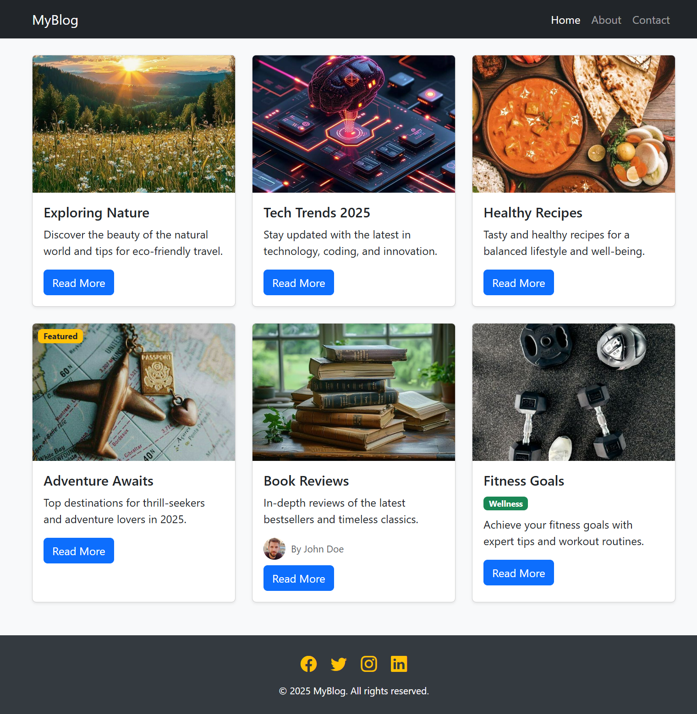

# Simple Bootstrap 5 Blog

A responsive blog page built with Bootstrap 5 CDN, featuring a modern layout, navbar, cards, and footer. Easily customizable and mobile-friendly.

## Features
- **Bootstrap 5 CDN**: No setup required, just open `index.html`.
- **Responsive Navbar**: Brand and navigation links, collapses on mobile.
- **Blog Cards**: Each post is a card with image, title, description, and a "Read More" button.
- **Bootstrap Grid**: Cards arranged responsively for all screen sizes.
- **Footer with Social Icons**: Quick links to social media using Bootstrap Icons.
- **Custom Spacing & Colors**: Uses Bootstrap utility classes for padding, margin, and color.

## Unique Features
- **Featured Post Ribbon**: Highlighted badge on a card to mark it as featured.
- **Author Info**: Author avatar and name displayed on a card.
- **Category Tag**: Category badge for quick post identification.
- **Modern Shadow & Rounded Corners**: Cards have subtle shadows and rounded corners for a clean look.
- **Accessible**: Uses semantic HTML and alt text for images.

## Getting Started
1. Clone or download this repository.
2. Open `index.html` in your browser.
3. No build steps or dependencies required.

## Customization
- Replace images with your own URLs.
- Edit card titles, descriptions, and links.
- Add or remove cards as needed.
- Change brand name and navbar links.

## Testing Responsiveness
- Open in your browser and resize the window.
- Test on mobile, tablet, and desktop.

## Screenshots

---

**Made using Bootstrap 5.**
